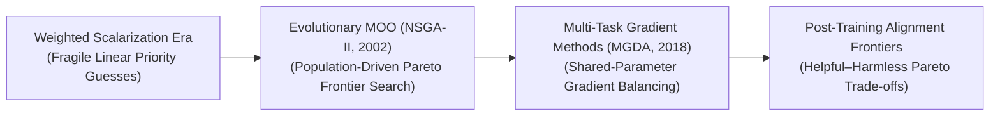
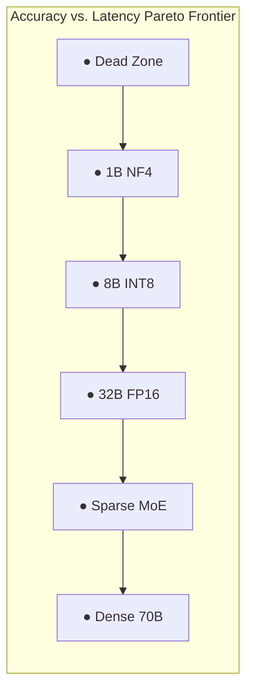
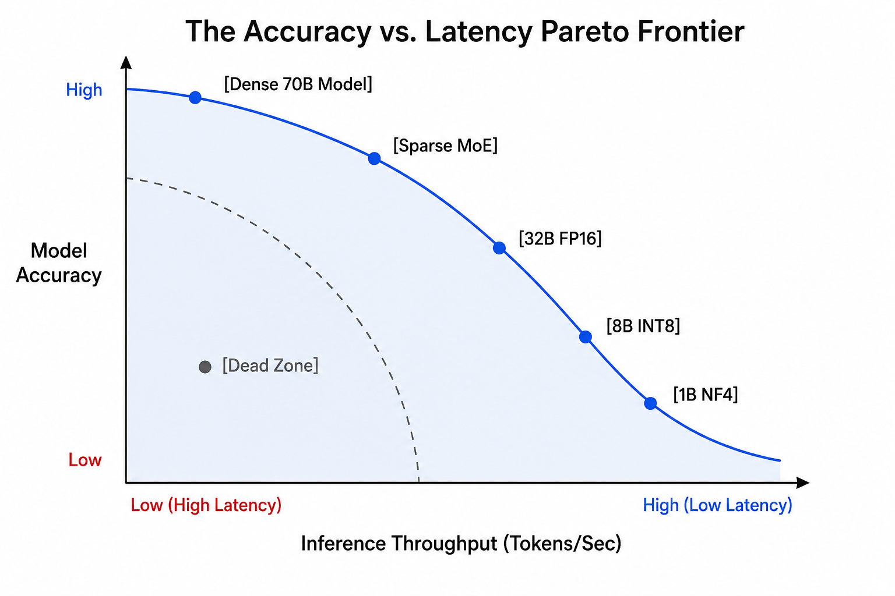

# Awesome-Pareto-Optimality
## Pareto Optimality in AI: History, Progression, Variants, & Applications

**Pareto Optimality**—fundamentally rooted in multi-objective optimization (MOO) and microeconomic game theory—is an algorithmic framework designed to balance conflicting goals or evaluation metrics within artificial intelligence systems. A system state or model configuration is defined as **Pareto Optimal** (or Pareto efficient) if it is mathematically impossible to improve one specific objective without making at least one other objective strictly worse. The complete set of these non-dominated, optimal trade-off configurations maps out a geometric boundary known as the **Pareto Frontier**. 

In contemporary artificial intelligence, Pareto Optimality serves as the foundational mathematical engine guiding resource allocation, hyperparameter tuning, model compression, and safety alignment, transforming single-metric maximization into nuanced, multi-dimensional optimization.

---

## 1. The Macro Chronological Evolution

The implementation of Pareto boundaries in AI has transitioned from classical scalarized searches to evolutionary population tracking, moving toward modern gradient-based multi-task loops and test-time alignment frontiers.

*   **The Linear Weighted Scalarization Era (Traditional ML Baseline)**
    *   *Concept:* The early foundational baseline. Multi-objective optimization was handled by manually combining conflicting goals into a single, global loss function using static multipliers: $\mathcal{L}_{\text{global}} = \alpha \mathcal{L}_1 + \beta \mathcal{L}_2$.
    *   *Limitation:* Highly fragile and dependent on arbitrary human guesswork. Linear scalarization cannot capture non-convex regions of the true Pareto Frontier, meaning the optimizer skips critical trade-off thresholds entirely if the underlying mathematical boundary curves irregularly.
*   **The Population-Driven Evolutionary Era (NSGA-II / SPEA2, ~2002–2017)**
    *   *Concept:* Ported Pareto tracking into genetic and evolutionary algorithms. Frameworks like **NSGA-II (Non-dominated Sorting Genetic Algorithm II)** maintained a diverse pool of model candidates simultaneously. Individuals were sorted and ranked based on their absolute dominance vectors, utilizing crowding distance metrics to ensure the population spread out evenly along the entire length of the physical Pareto Frontier.
    *   *Significance:* Successfully mapped non-convex optimization boundaries, standardizing automated Neural Architecture Search (NAS) and hardware-aware structural pruning pipelines.
*   **The Multi-Task Gradient-Based Era (MGDA, ~2018–2023)**
    *   *Concept:* Integrated multi-objective Pareto optimization straight into end-to-end backpropagation. Algorithms like the **Multiple Gradient Descent Algorithm (MGDA)** calculated the exact intersection vector of conflicting task gradients. By finding a shared direction that simultaneously minimizes all losses, the backpropagation loop acts as a true Pareto descent mechanism.
    *   *Significance:* Allowed deep multi-task networks (e.g., computer vision backbones executing simultaneous object detection, segmentation, and depth estimation) to train stably without a single task over-correcting or erasing the parameters of another.
*   **The Post-Training Foundation Alignment Era (~2024–Present)**
    *   *Concept:* The current modern state-of-the-art frontier standard. Addresses the fundamental capability tensions embedded within modern Large Language Models and reasoning architectures. Alignment teams optimize policies across the **"Helpful vs. Harmless vs. Honest" Pareto Frontier**. 

---

## 2. Core Functional & Algorithmic Variants

Pareto frameworks are strictly categorized based on how the optimization graph parses multi-objective dominance vectors at runtime.

- ### A. Pareto Dominance Sorting
	*   **Mechanism:** A vector $u = (u_1, \dots, u_m)$ is said to strictly dominate another vector $v = (v_1, \dots, v_m)$ if and only if every individual coordinate of $u$ is greater than or equal to $v$, and at least one coordinate is strictly greater ($u_i > v_i$). The algorithm filters out dominated variants to isolate the pristine Pareto Frontier.

- ### B. Multiple Gradient Descent Algorithm (MGDA)
	*   **Mechanism:** Formulates multi-task learning as a multi-objective optimization problem. It solves a custom optimization sub-problem over active layer gradients at each epoch step:
	    $$\min_{\alpha} \left\| \sum_{t=1}^{T} \alpha_t \nabla_{\theta} \mathcal{L}_t \right\|^2, \quad \text{subject to} \quad \sum \alpha_t = 1, \, \alpha_t \ge 0$$
	*   **Behavior:** Finds a minimum-norm common gradient direction. If the solution collapses to absolute zero, it mathematically proves the model has hit a local Pareto Critical Point.

- ### C. Pareto Hypernetwork Steering
	*   **Mechanism:** Trains a secondary, conditioning neural network (a Hypernetwork) to output the exact weights of a target network on-the-fly. The hypernetwork reads an arbitrary preference vector (e.g., instructing the system to prioritize 80% inference speed and 20% model precision), instantly tuning the target network to that specific coordinate on the Pareto Frontier.

---

## 3. Structural AI System Trade-Off Profiles

Depending on the operational constraints of the infrastructure stack, Pareto optimization balances distinct multi-dimensional capabilities.

*   **The Hardware-Aware Efficiency Frontier (Accuracy vs. Latency)**
    *   *Profile:* Optimizes model deployment footprints. It balances model reasoning accuracy against physical compute latencies, VRAM constraints, and energy boundaries.
    *   *Significance:* Guides **Quantization and Weight-Pruning schedules** [INDEX: 16], allowing developers to select the optimal model size that delivers the highest possible factual performance within strict edge-device microcontroller hardware limitations.

  

*   **The "Alignment Tax" Frontier (Helpful vs. Harmless)**
    *   *Profile:* Shapes foundational behavioral distributions. Pushing a model to be perfectly *harmless* (via intense safety fine-tuning) can trigger **Refusal Underfitting**, making it less *helpful* because it over-generalizes safety masks and refuses benign queries. Pareto optimization via custom DPO loss weights calibrates the precise boundary intersection to maximize utility safely.

---

## 4. Production Engineering Challenges & Hardware Solutions

Enforcing complex multi-objective Pareto allocations across high-throughput distributed training environments introduces unique runtime scaling bottlenecks.

*   **The Gradient Conflict and Optimization Stagnation Wall**
    *   *The Problem:* In large-scale distributed multi-task pre-training, separate loss functions can output opposing gradient updates (e.g., task A commands a weight to increase, while task B commands it to decrease). If executed naively, these conflicting forces cancel each other out, locking the model into a sub-optimal training plateau where it ceases to converge.
    *   *Mitigation:* Implementing **Gradient Surgery layers (such as PCGrad / Projecting Conflicting Gradients)**, which identify conflicting vectors at runtime and mathematically project each gradient onto the normal plane of the other, neutralizing destructive interference before parameters are updated.
*   **The High Cost of Infinite Frontier Sampling**
    *   *The Problem:* Mapping out an explicit, dense Pareto Frontier using traditional evolutionary or grid-search methods requires running thousands of independent, full-scale training iterations, which consumes unsustainable token budgets and millions of dollars in GPU compute.
    *   *Mitigation:* Deploying **Monolithic Multi-Task Loss Functions with Dynamic Scaling Weights** (such as GradNorm or Kendall’s Uncertainty Weighting), which automatically adjust task priorities on-the-fly inside a single training run based on relative layer gradient scales.

---

## 5. Frontier Real-World AI Applications

*   **Post-Training Safety & Persona Alignment for Foundation LLMs**
    *   *Application:* Calibrates conversational deployment boundaries. Advanced reinforcement learning pipelines deploy multi-objective reward models to evaluate model responses against conflicting criteria concurrently, ensuring outputs maintain optimal balances between factual precision, helpful verbosity, and strict safety guidelines.
*   **Multi-Task Autonomous Perception Stacks for Self-Driving Vehicles**
    *   *Application:* Ingests continuous high-frame-rate streaming camera video and LiDAR 3D coordinates simultaneously [INDEX: 1]. A unified residual backbone network executes multi-task predictions—running object detection bounding, lane segmentation, and depth estimation concurrently—using Pareto gradient surgery to ensure all visual tasks optimize without corrupting adjacent feature maps [INDEX: 1].
*   **Hardware-Aware Neural Architecture Search (NAS) for Edge AI**
    *   *Application:* Compresses model footprints to fit within consumer edge hardware (smartphones, automobiles, wearables) [INDEX: 16]. Evolutionary Pareto optimization loops evaluate hundreds of structural sub-networks, automatically isolating the "winning tickets" that minimize VRAM footprints while maximizing accuracy thresholds [INDEX: 16].

---

## References
1. Deb, K., et al. (2002). A fast and elitist multiobjective genetic algorithm: NSGA-II. *IEEE Transactions on Evolutionary Computation*, 6(2), 182-197.
2. Sener, O., & Koltun, V. (2018). Multi-task learning as multi-objective optimization. *Advances in Neural Information Processing Systems (NeurIPS)*, 31.
3. Yu, T., et al. (2020). Gradient surgery for multi-task learning. *arXiv preprint arXiv:2001.06782*.
4. Lin, X., et al. (2019). Pareto multi-task learning. *Advances in Neural Information Processing Systems (NeurIPS)*, 32.
5. Navon, A., et al. (2021). Learning the Pareto frontier with hypernetworks. *International Conference on Learning Representations (ICLR)*.
6. Ouyang, L., et al. (2022). Training language models to follow instructions with human feedback. *Advances in Neural Information Processing Systems (NeurIPS)*.

---

To advance this documentation repository, multi-objective testing architecture, or MLOps pipeline, consider exploring these adjacent development pathways:
* Build a **Python script using PyTorch** illustrating how to implement a basic Projecting Conflicting Gradients (PCGrad) surgery layer to handle conflicting multi-task gradient updates.
* Generate a **comprehensive Markdown table** explicitly comparing Linear Scalarization, Evolutionary Sorting (NSGA-II), Gradient-Based MGDA, and Pareto Hypernetworks across computational time complexities, tracking structure types (static vs. dynamic), capability optimization agility, and hardware training overhead.
* Establish a **performance profiling notebook using Triton** to track the exact computational throughput and memory bus latency metrics achieved when fusing a multi-task loss calculation and common-gradient normalization pass directly into single-pass GPU memory.

***

**Proactive Repository Follow-Ups:**

To assist with your documentation repository setup, let me know how you would like to proceed by choosing one of the options below:
* I can provide a **complete Python code boilerplate using NumPy** demonstrating how to write an automated script that calculates non-dominated sorting layers to isolate a Pareto Frontier from a cloud log matrix.
* I can generate a **Markdown matrix table** tracking the explicit multi-objective balance rules and optimization parameters utilized by leading enterprise architectures to manage the "Alignment Tax."
* I can write a detailed technical explanation focusing on **how to configure dynamic task weighting** using Kendall's homoscedastic uncertainty loss mechanics smoothly at training time.

