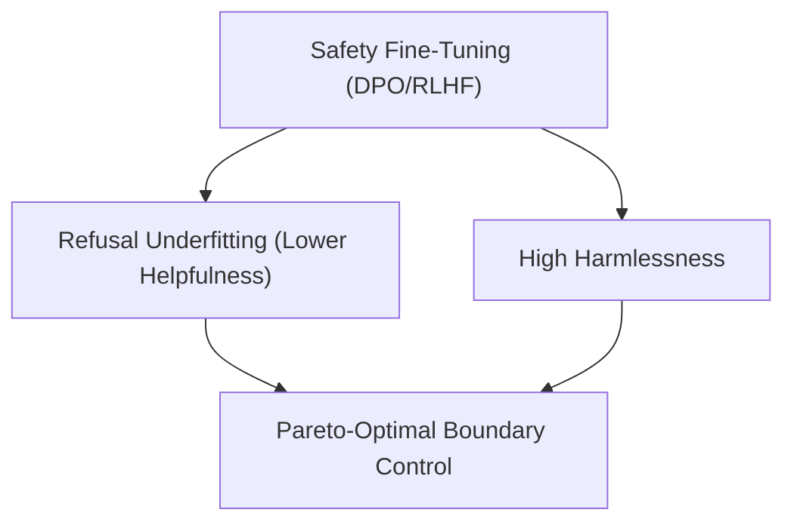

# The 'Alignment Tax' Frontier

The Alignment Tax represents the performance degradation on general capabilities when aligning models to safety constraints. Pushing safety alignment to prevent harmful responses can lead to over-refusal of benign requests. Navigating the Helpful-Harmless Pareto Frontier is critical to balancing usefulness and safety.

## Conceptual Diagram

---

[← Back to README](../README.md)
