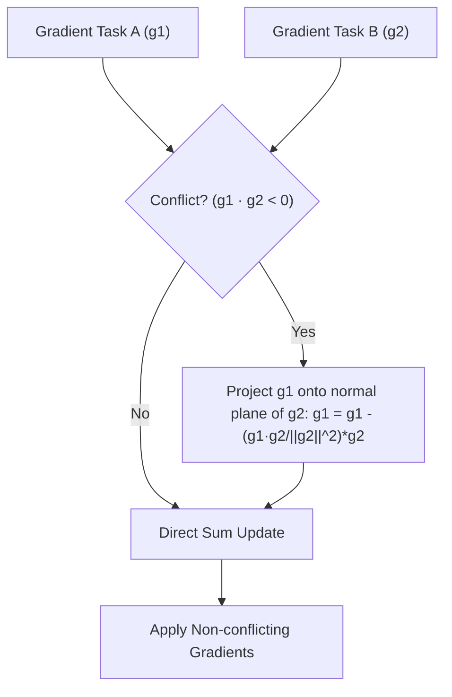

# Gradient Conflict and Optimization Stagnation Wall

During multi-task pre-training, conflicting task gradients can point in opposing directions, causing destructive interference. If updates cancel out, optimization stagnates. Mitigation strategies like PCGrad (Projecting Conflicting Gradients) identify conflicts and project conflicting gradient components onto the normal plane of one another.

## Conceptual Diagram

---

[← Back to README](../README.md)
