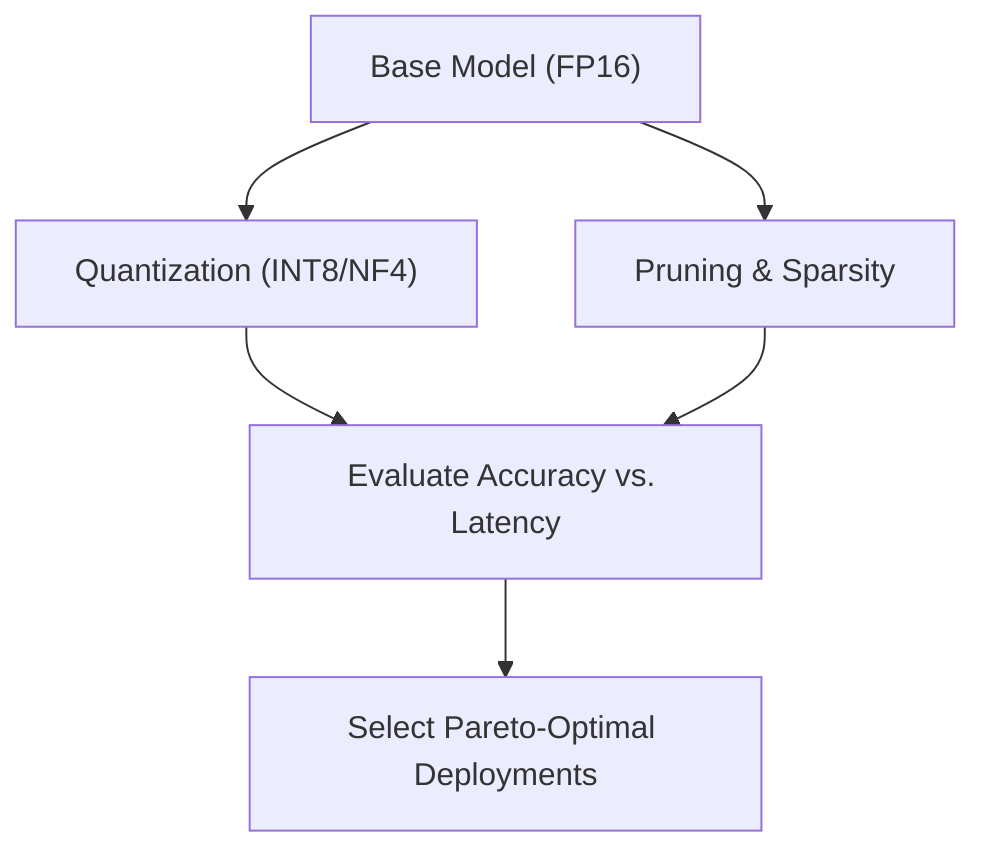

# Hardware-Aware Efficiency Frontier

Optimizing deep learning models for deployment requires balancing model accuracy against physical hardware constraints. These constraints include latency, VRAM footprint, memory bandwidth, and power consumption. Quantization and pruning schedules map out the accuracy-latency Pareto Frontier, guiding structural decisions for edge devices.

## Conceptual Diagram

---

[← Back to README](../README.md)
