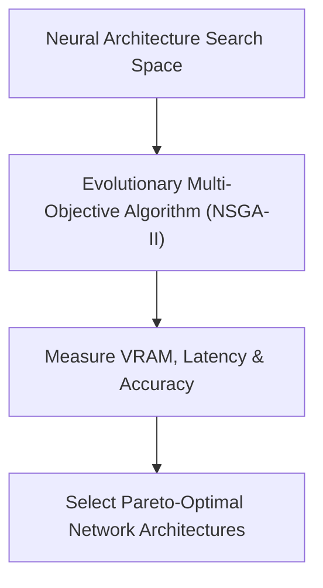

# Hardware-Aware Neural Architecture Search (NAS)

Neural Architecture Search (NAS) finds optimal neural network designs by evaluating accuracy against VRAM and latency constraints. Evolutionary multi-objective algorithms like NSGA-Net search through architecture pools to discover the Pareto-optimal 'winning tickets' suitable for edge deployment.

## Conceptual Diagram

---

[← Back to README](../README.md)
