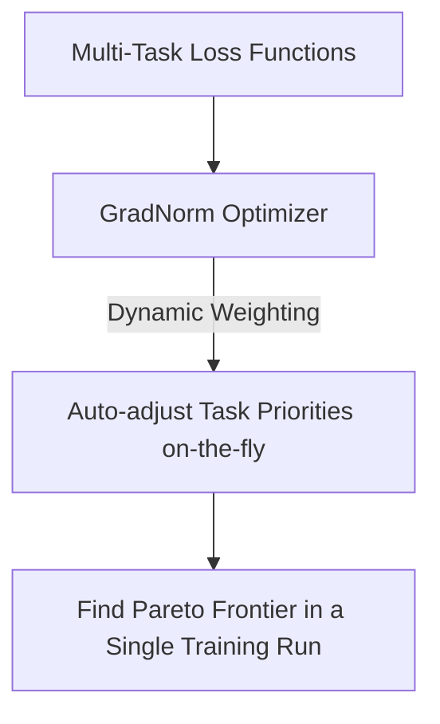

# High Cost of Infinite Frontier Sampling

Sampling a dense Pareto Frontier using evolutionary or grid search requires training thousands of configurations, which is extremely expensive. Mitigation techniques like GradNorm and dynamic loss weighting balance task training dynamically in a single run, significantly reducing compute costs.

## Conceptual Diagram

---

[← Back to README](../README.md)
