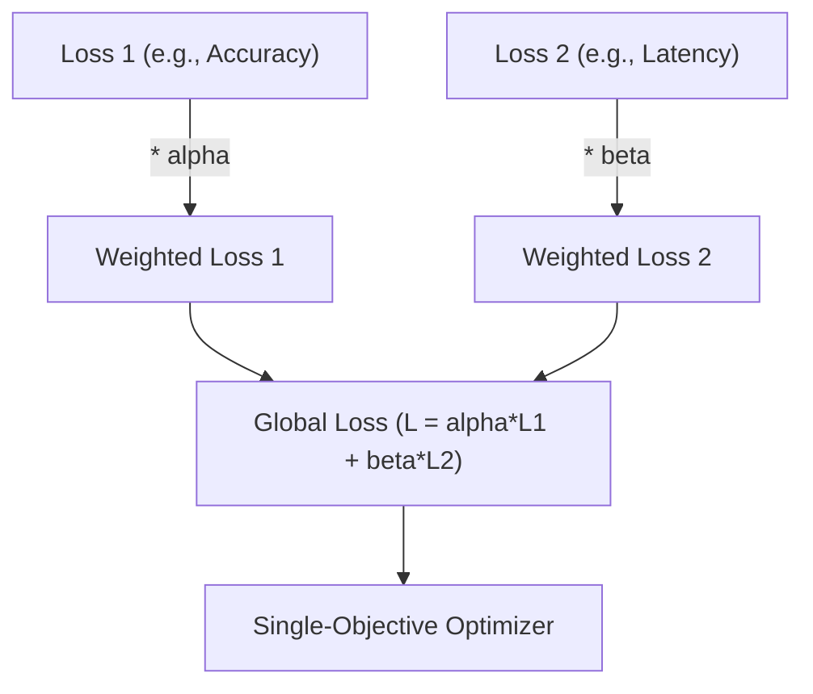

# Linear Weighted Scalarization Era

Linear Weighted Scalarization is the traditional baseline for multi-objective optimization (MOO). It works by assigning static multipliers (weights) to each conflicting goal to combine them into a single global loss function. While simple and computationally efficient, its major limitation is its inability to capture non-convex regions of the true Pareto Frontier, meaning key trade-offs may be skipped entirely.

## Conceptual Diagram

---

[← Back to README](../README.md)
