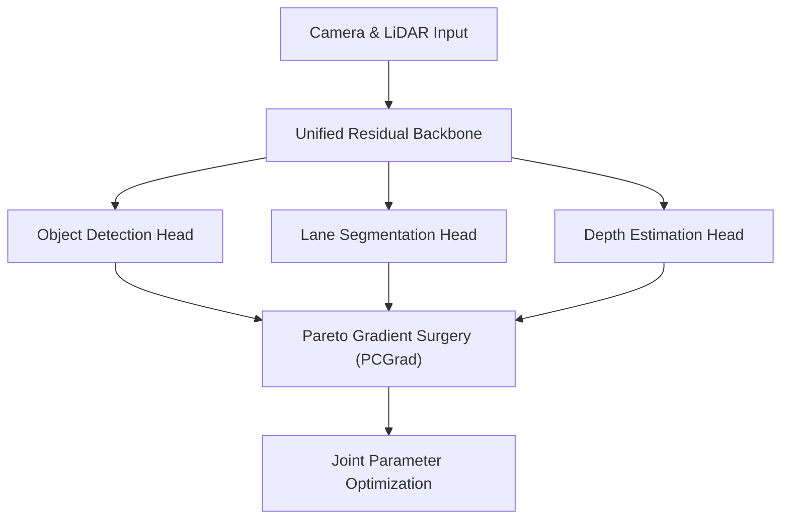

# Multi-Task Autonomous Perception Stacks

Self-driving vehicles process video and LiDAR data through unified multi-task architectures. These backbones perform object detection, lane segmentation, and depth estimation concurrently. Pareto gradient surgery is used to ensure optimization of one head does not corrupt adjacent feature representations.

## Conceptual Diagram

---

[← Back to README](../README.md)
