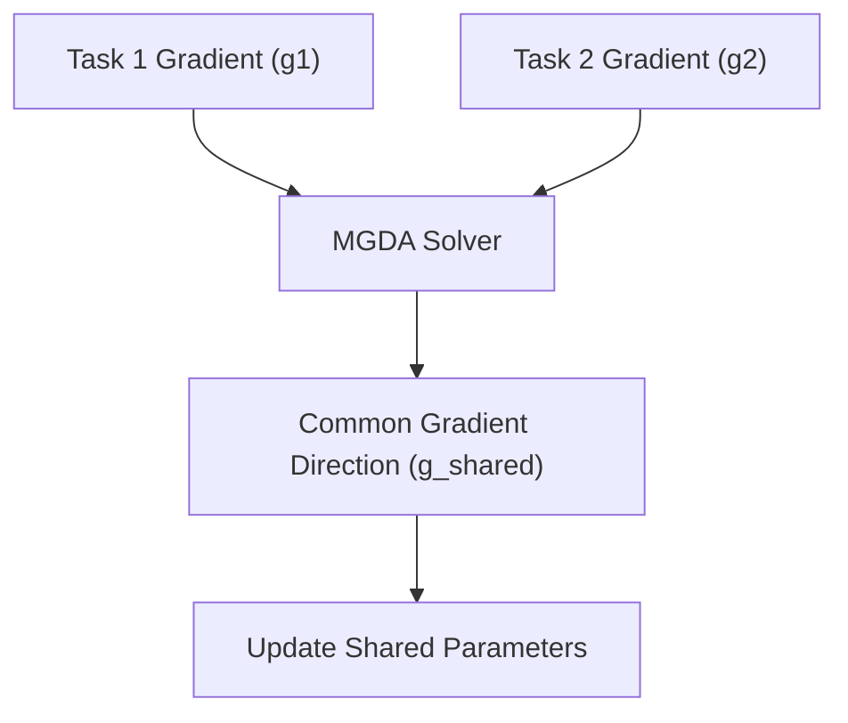

# Multi-Task Gradient-Based Era

The Gradient-Based Era integrated multi-objective optimization directly into backpropagation. Using algorithms like MGDA (Multiple Gradient Descent Algorithm), shared parameters are optimized by finding the exact intersection vector of conflicting task gradients. This ensures all tasks improve without any single task dominant-updating and erasing others.

## Conceptual Diagram

---

[← Back to README](../README.md)
