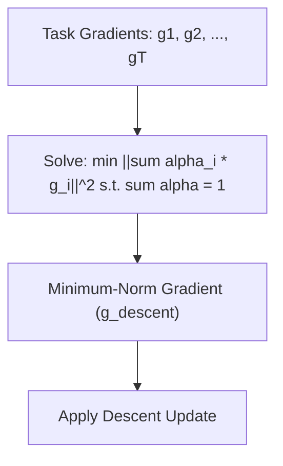

# Multiple Gradient Descent Algorithm (MGDA)

MGDA formulates multi-task learning as a multi-objective optimization problem. It solves for a convex combination of gradients that minimizes the common descent direction norm. If the minimum-norm direction is zero, the optimizer has reached a Pareto critical point where no further multi-objective improvement is possible.

## Conceptual Diagram

---

[← Back to README](../README.md)
