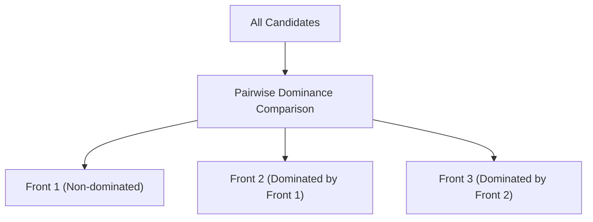

# Pareto Dominance Sorting

Pareto Dominance Sorting partitions a set of candidate solutions into hierarchical fronts. A solution strictly dominates another if it is at least as good in all objectives and strictly better in at least one. The non-dominated solutions form the first front, and the process repeats to isolate consecutive Pareto frontiers.

## Conceptual Diagram

---

[← Back to README](../README.md)
