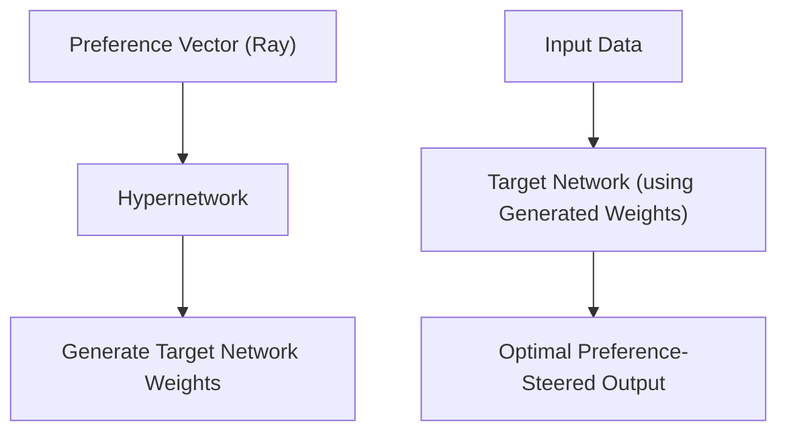

# Pareto Hypernetwork Steering

Pareto Hypernetwork Steering trains a meta-network (Hypernetwork) to generate the weights of a target network dynamically. By inputting a desired preference ray (e.g., 70% latency reduction vs 30% accuracy enhancement), the hypernetwork outputs target weights specialized for that specific Pareto frontier coordinate in a single forward pass.

## Conceptual Diagram

---

[← Back to README](../README.md)
