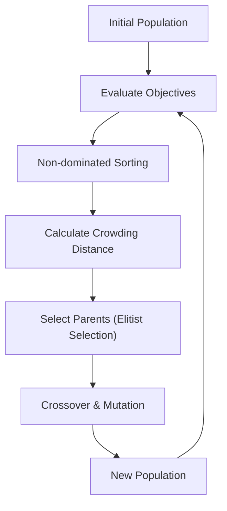

# Population-Driven Evolutionary Era

The Evolutionary Era ported Pareto tracking into genetic algorithms. Popular frameworks like NSGA-II (Non-dominated Sorting Genetic Algorithm II) and SPEA2 maintained a diverse population of candidate solutions. Individuals are ranked based on non-domination layers, and crowding distance metrics are employed to ensure a uniform distribution of candidates along the Pareto Frontier.

## Conceptual Diagram

---

[← Back to README](../README.md)
