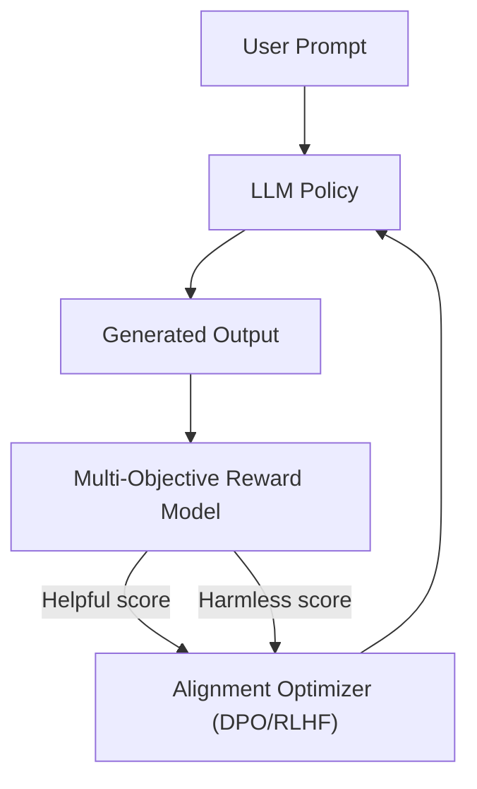

# Post-Training Foundation Alignment Era

Modern state-of-the-art alignment for Large Language Models. Multi-objective optimization balances conflicting priorities such as being helpful, harmless, and honest. Using RLHF, DPO, and multi-objective reward modeling, policies are aligned to navigate the optimal trade-off space along these human-preference boundaries.

## Conceptual Diagram

---

[← Back to README](../README.md)
