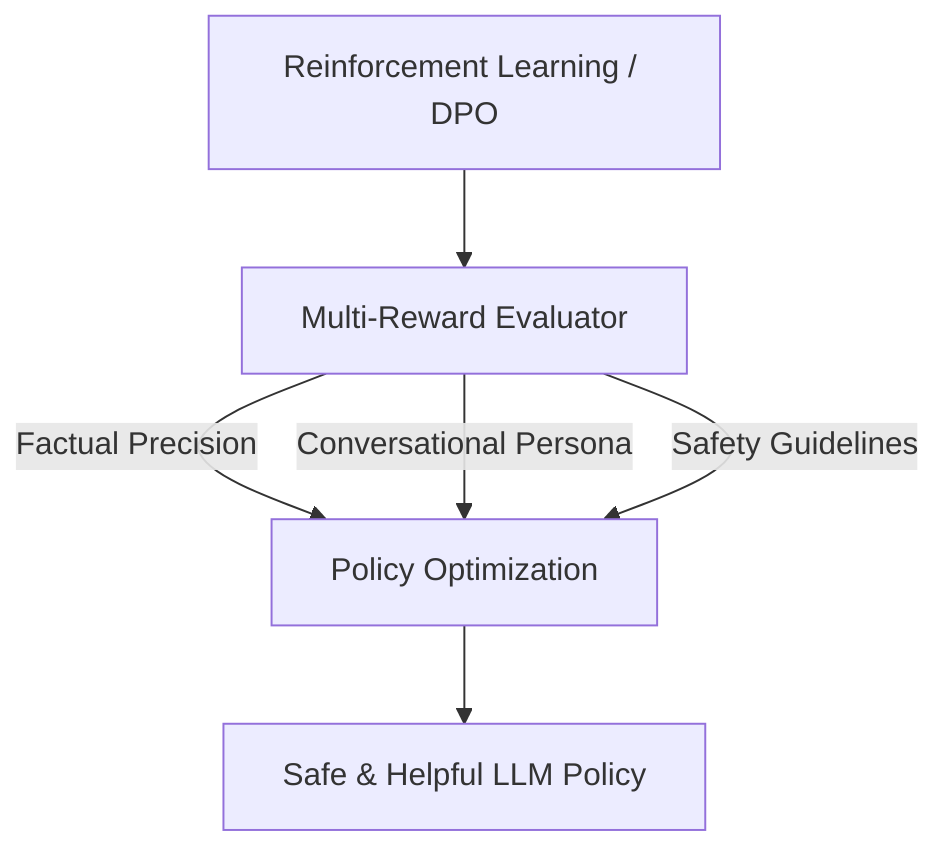

# Post-Training Safety & Persona Alignment

Post-training safety alignment shapes the deployment profile of LLMs. By using multi-objective reinforcement learning or direct preference optimization, safety guidelines are balanced against user alignment and conversational personas to ensure helpfulness and harmlessness are well-optimized.

## Conceptual Diagram

---

[← Back to README](../README.md)
